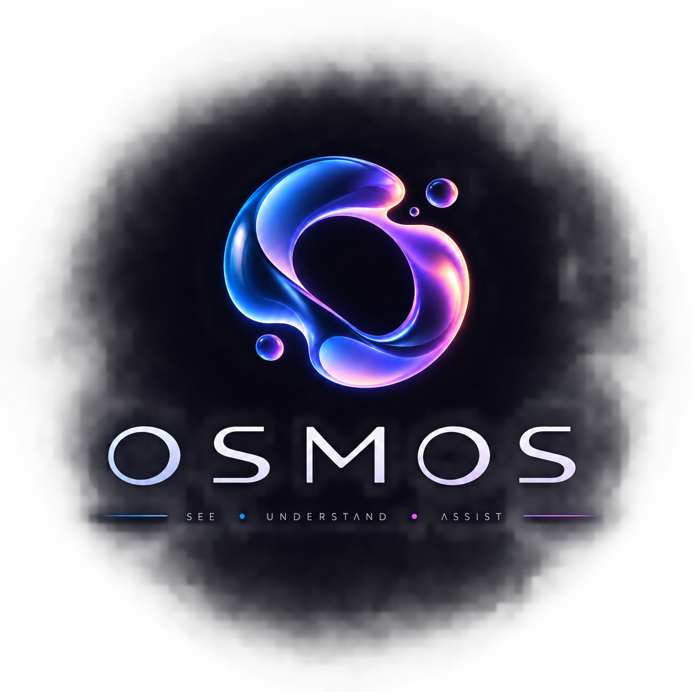
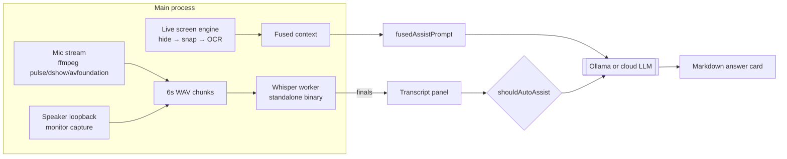

<p align="center">
  
</p>

<h1 align="center">OSMOS</h1>

<p align="center">
  <strong>A local-first, open-source AI copilot for interviews, meetings, and calls.</strong><br/>
  Listens to the room, reads your screen, and drafts answers — while everything stays on your machine.
</p>

<p align="center">
  <a href="#license"></a>
  <a href="#install--run"></a>
  
</p>

---

## What is OSMOS?

OSMOS is a desktop overlay copilot that:

- **Listens** — live microphone + speaker-loopback capture, transcribed locally with Whisper (or your cloud provider of choice)
- **Reads** — background screen OCR keeps a fresh snapshot of what's on your display, so every answer already knows your context
- **Answers** — streaming LLM responses rendered as clean markdown inside an always-on-top overlay
- **Stays invisible** — OS-level capture exclusion keeps the overlay out of Zoom / Teams / Meet / OBS screen shares

Everything runs **on your machine**: audio never leaves it unless *you* pick a cloud STT/LLM provider. No account. No telemetry. No subscription.

---

## Features

### 🎧 Smart Listen (dual-ear audio)
| Ear | Source | Notes |
|---|---|---|
| **mic** | Your microphone | Continuous main-process capture — survives UI churn; self-heals with respawn + stall watchdog |
| **spk** | Speaker loopback | Transcribes call/meeting audio playing through the machine |

- Finalized speech lands in a **live transcript panel** beside chat — verify accuracy in real time
- One-click **Copy** exports the full timestamped transcript for session notes
- Silence is skipped intelligently (no wasted transcription), and non-speech markers like `[Music]` are filtered out of notes

### 👁 Live Screen Reading
Cluely-style continuous context: every ~2.5s OSMOS snapshots the display, hides its own overlay first so it never OCRs itself, runs hash-deduplicated OCR (unchanged screens cost almost nothing), and feeds the text into every answer automatically. No buttons mid-session.

### ⚡ Smart Mode
One toggle orchestrates both ears + live screen. A visible `● REC` chip stays on while capture is active — honest by default.

### 🛡 Low-profile (stealth)
- **Windows**: `SetWindowDisplayAffinity(WDA_EXCLUDEFROMCAPTURE)` — excluded from all DWM-based captures (Zoom, Teams, Meet, Webex, OBS)
- **macOS**: `NSWindowSharingNone` via `setContentProtection` — outside ScreenCaptureKit streams
- Exclusion re-asserted on show/focus/display changes; skip-taskbar + always-on-top included
- Honest limits: hardware HDMI dongles and phone cameras see everything — physics, not software

### 🧠 Profiles & Interview Intelligence
Named multi-profiles, each carrying: résumé + job description, company intel (auto-researched), role documents (TF-IDF retrieval), question bank with STAR stories, mode prompts (interview / meeting / general), and per-agent provider overrides.

### 💬 Chat that respects your stack
Ollama (local) first-class; OpenAI / Anthropic / Groq / OpenRouter / LiteLLM via one OpenAI-compatible surface. Streaming, cancel, markdown rendering sanitized with DOMPurify.

### 🔇 Zero-dependency installs
The audio worker ships as a **frozen standalone binary** (PyInstaller) built per-platform in CI — users install nothing: no Python, no pip, no PortAudio. Linux needs only `ffmpeg` from distro repos.

---

## How it works



Key design rule: **all capture lives in the main process** (`src/main/services/micStream.ts`, `linuxLoopbackStream.ts`, `screenLive.ts`). The renderer only transcribes chunks and renders UI, so React lifecycle can never kill a recording.

---

## Install & Run

### End users
Grab an installer from [Releases](https://github.com/taksha17/osmos/releases) (built automatically by CI for Windows / macOS / Linux).

- **Windows**: NSIS installer; bundled ffmpeg + audio worker
- **macOS**: `.dmg` (unsigned for now — right-click → Open pastes Gatekeeper)
- **Linux**: `.deb` / AppImage; requires `ffmpeg` (`sudo apt install ffmpeg`) and PipeWire/Pulse

### Developers

```bash
git clone https://github.com/taksha17/osmos.git
cd osmos
npm install
npm run dev          # Vite :5179 + Electron; auto-builds frozen audio worker once
npm run typecheck    # strict TS across main/preload/renderer
npm run build        # renderer + electron bundles
npm run pack:linux   # deb/AppImage on Linux host (pack:mac / pack:win on their hosts)
```

Pushing a `v*` tag triggers the CI matrix → signed artifacts land on the GitHub Release.

<details>
<summary>Configuration highlights (Settings → …)</summary>

- **Speech**: STT engine (local-whisper / openai-whisper / webspeech), mic picker, language, **🎙 Test mic** with live volume meter + peak hold
- **Smart assist audio**: mic / system / both
- **Models**: Ollama host probe, provider API keys (encrypted at rest via OS keychain)
- **Web search**: DuckDuckGo / SearXNG / Tavily grounding
- **Low-profile**: capture exclusion toggle
- **Local data**: delete-all sessions & transcripts

</details>

---

## Why OSMOS over Cluely / Natively?

| | **OSMOS** | Cluely | Natively |
|---|---|---|---|
| **Price** | Free, MIT | $20–100/mo | Paid tiers |
| **Where your data goes** | Stays on disk; cloud only if you opt in | Cloud pipeline by design | Cloud |
| **Open source** | ✅ MIT — audit every line | ❌ Closed | ❌ Source-available (restricted) |
| **Telemetry** | None | Analytics on by default | Yes |
| **Local LLM support** | ✅ First-class (Ollama) | ❌ | Limited |
| **Local STT** | ✅ Whisper worker, zero-dep binary | Cloud | Cloud/hybrid |
| **Cross-platform** | Win + macOS + Linux | Win + mac | mac-centric |
| **Recording transparency** | Visible ● REC chip + one-click purge | Covert by positioning | N/A |
| **Lock-in** | Your models, your keys, your files | Their stack | Their stack |

**The short version:** OSMOS gives you the same real-time copilot capability without shipping your interview audio, screen contents, résumé, and API keys through someone else's server — and without a subscription metering your career.

---

## Privacy, consent & legal notes

- **Consent laws vary.** Many jurisdictions require all-party consent to record conversations. OSMOS shows a persistent `● REC` indicator whenever capture is active — use it responsibly and follow your local law.
- **Other people's words are their data.** Transcripts stored locally include other participants; Settings → Stealth → *Delete all sessions & transcripts* purges them instantly.
- **Cloud providers have usage policies.** If interview-assist use conflicts with a provider's terms, use the local path (Ollama + local Whisper) — fully supported.
- **No analytics.** No crash reporting, no telemetry, no phone-home. The update check hits a static feed you configure.

See [`docs/ROADMAP.md`](docs/ROADMAP.md) for status and [`AGENTS.md`](AGENTS.md) for contributor/architecture conventions.

---

## License

MIT — see [LICENSE](LICENSE). Bundled runtime dependencies keep their own licenses; the frozen audio worker bundles Python+NumPy under their respective licenses.
